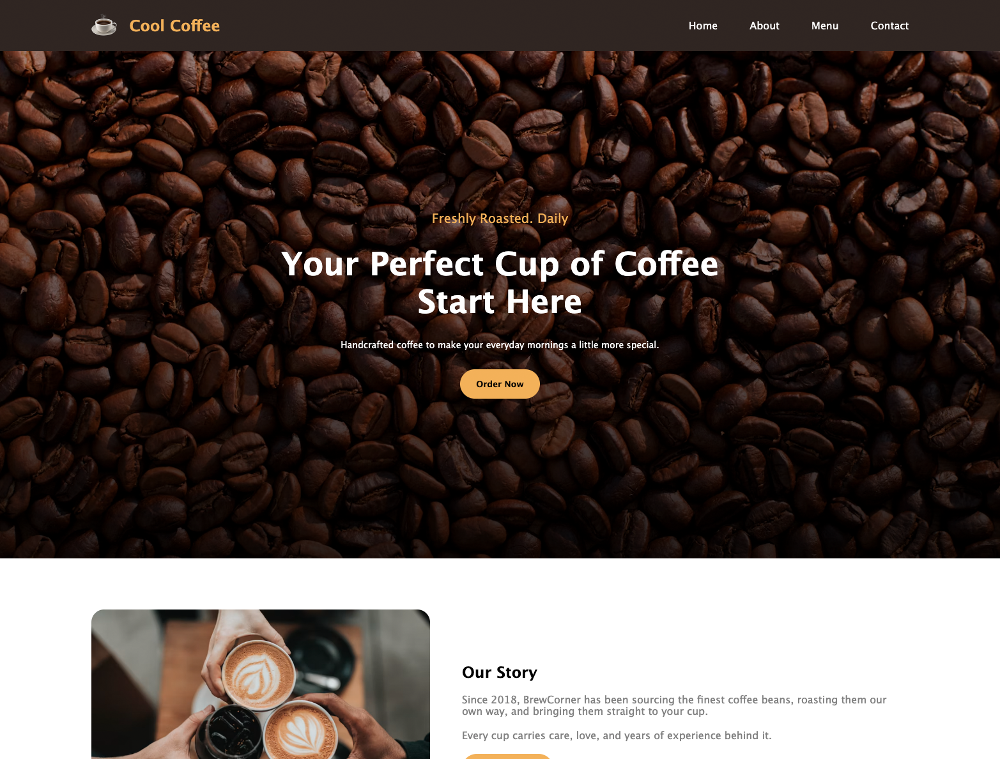

# ☕ Cool Coffee — Coffee Shop Website

A modern and responsive coffee shop landing page built with **HTML5 and CSS3**.

The project focuses on creating a clean and welcoming coffee shop experience with a strong visual hierarchy, responsive layouts, menu cards, business information, and clear calls to action.

## 🌐 Live Demo

**[View Live Website](https://almamuncode.github.io/coffee-shop-site/)**

---

## 📸 Preview



---

## ✨ Features

- Responsive navigation bar
- Modern hero section with call-to-action
- Coffee shop story / about section
- Popular coffee menu cards
- "Why Us" feature section
- Opening hours table
- 24/7 availability callout section
- Responsive footer
- Contact information section
- Social media links
- Responsive layout for desktop, tablet, and mobile devices
- Clean and reusable HTML/CSS structure

---

## 🛠️ Technologies Used

- **HTML5** — Semantic page structure
- **CSS3** — Styling, layouts, responsiveness, and visual effects
- **Figma** — UI design and planning
- **Git & GitHub** — Version control and project hosting
- **GitHub Pages** — Deployment

> This project does not use JavaScript, a CSS framework, or external package dependencies.

---

## 📂 Project Structure

```text
coffee-shop-site/
│
├── image/
│   ├── icons/
│   ├── bg-image.avif
│   ├── cup.png
│   ├── our-story.avif
│   ├── footer-img.avif
│   └── ...
│
├── index.html
├── style.css
└── README.md
```

---

## 🚀 Getting Started

### 1. Clone the repository

```bash
git clone https://github.com/almamuncode/coffee-shop-site.git
```

### 2. Navigate to the project

```bash
cd coffee-shop-site
```

### 3. Open the project

This is a static HTML/CSS project, so no package installation is required.

You can open `index.html` directly in your browser.

For a better development experience, use **VS Code with Live Server** or another local development server.

---

## 💻 Run with VS Code Live Server

1. Open the project in VS Code.
2. Install the **Live Server** extension.
3. Right-click `index.html`.
4. Select **Open with Live Server**.

The project will open in your browser.

---

## 📱 Responsive Design

The website is designed to provide a responsive experience across:

- Desktop
- Laptop
- Tablet
- Mobile devices

The layout adapts navigation, content sections, cards, typography, spacing, and other elements according to the screen size.

---

## 🎨 Design & Development

The website was designed and developed as a coffee shop landing page with a warm, modern visual style.

The implementation focuses on:

- Visual hierarchy
- Typography
- Spacing
- Responsive layouts
- Flexbox-based layouts
- Card-based UI
- Call-to-action placement
- Consistent color usage
- Responsive media queries
- Image-based visual sections

The project also includes the original **Figma design file** used during the design process.

---

## 📚 Main Sections

### 🏠 Hero

Introduces the coffee shop with a prominent headline, supporting text, and an **Order Now** call-to-action.

### 📖 Our Story

Introduces the coffee shop's story and provides an **Explore Menu** call-to-action.

### ☕ Our Menu

Displays popular coffee selections with descriptions and pricing.

### ⭐ Why Us

Highlights key benefits:

- Fresh Beans
- Fast Delivery
- Made With Love

### 🕒 Opening Hours

Displays the coffee shop's operating hours in a structured table.

### 🌙 24/7 Availability

A dedicated callout section highlighting the shop's 24/7 availability.

### 📍 Footer

Includes:

- Brand information
- Quick navigation links
- Contact information
- Social media links

---

## 📦 Dependencies

This project has **no package dependencies**.

It is built using:

- HTML5
- CSS3
- Local image assets

No `package.json`, npm packages, JavaScript libraries, or CSS frameworks are required to run the project.

---

## 🚀 Deployment

The website is deployed using **GitHub Pages**.

### Live Website

**[https://almamuncode.github.io/coffee-shop-site/](https://almamuncode.github.io/coffee-shop-site/)**

---

## 📚 What I Learned

Through this project, I practiced:

- Writing semantic HTML
- Structuring a multi-section landing page
- Building layouts with CSS Flexbox
- Creating responsive designs
- Working with CSS media queries
- Creating reusable UI patterns
- Managing image assets
- Working with Figma designs
- Using Git and GitHub
- Deploying static websites with GitHub Pages
- Translating a visual design into a functional website

---

## 👨‍💻 Author

**Md Al Mamun**

Junior Developer with a professional background in graphic and UI design.

- Portfolio: [almamuncool.com](https://www.almamuncool.com)
- GitHub: [@almamuncode](https://github.com/almamuncode)

---

## 📄 License

This project was created for educational and portfolio purposes.
